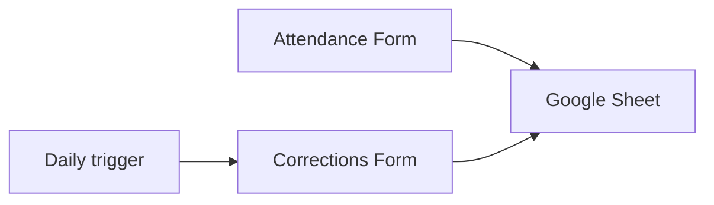

# Setup

To set up, you need to do the following (more details in the below steps): 

1. Create the Google Sheet
2. Create the Google forms and link to the sheet
3. Set up the Google Sheet (Process, Session, and Team tabs)
4. Create Apps Script Projects for dev and default sheet
5. Add Apps Script Project Ids to Github variables
6. Run Github workflows to deploy code
7. Start the triggers
8. Test the system is working

## Data flow

Attendance is tracked through the submission of a Google Form and data consequently goes into the Google Sheet. The 'Process' sheet is the source of truth for session attendance and is auto populated. A trigger is scheduled to check for incomplete entries daily, and that will prompt people to fill out another form for corrections. That form will also auto update the 'Process' sheet. 

The code to run the above is in this repo. There are also a few things which need to be set up in the Google Sheet. 

## Google Forms

You need to create two Google Forms, one for attendance, and one for corrections. Copy the ones from the previous year. Link them both with the Google Sheet and name those sheets 'Data' and 'Corrections'. 

## Google Sheets

There are two identical sheets used in this project: one is a development sheet to test code and the other is the sheet that is used to actually track attendance. 

In the sheet, create a new sheets called 'Process', 'Sessions', and 'Team'. Along with the 'Data' and 'Corrections' sheets, these are the only ones that are required for the Apps Script project to run; the rest are run through Google Sheets formulas. 

### Process Sheet
Set up the sheet as follows: 

The following are column headers: 
| Cell | Header            |
|------|-------------------|
| A1   | Name              |
| B1   | Date              |
| C1   | Start time        |
| D1   | End time          |
| E1   | Session length    |
| F1   | Session status    |
| G1   | Email sent time   |
| H1   | Session Type      |

Also add the following values: 

Cell J1:
- This cell contains the last row which should be checked by the attendance script, so all entries above will remain unchanged. 
- Formula: `formula to be added`. 

Cell L1: 
- This cell contains the last row with an entry. 
- Formula: `=ROWS(FILTER(A:A, NOT(ISBLANK(A:A))))`.

### Sessions Sheet

Add session dates in column A, expected session length in minutes in column B, and the type of session in column C. 

### Team sheet

Add team member names in column A and team member emails in column C. 

## Set up Apps Scipt Projects

In the sheets, click on Extensions -> Apps Scipt. You should create a new Apps Script Project. Go into Project Settings and copy your Script ID for later. 

## Update code / Github

Add the Script IDs to Github under Settings -> Secrets and Variables -> Variables -> Repository Variables. Name them `SCRIPT_ID_DEV` and `SCRIPT_ID_PROD`. 

You may also have to update the secret `CLASPRC_SECRET`. To find the value, run `clasp login` in the terminal followed by `cat ~/.clasprc.json`. Copy that value into the secret. This will allow the Github action to push code to the Apps Script Project. 

Update the Google Form link in [14_utils.js](./src/14_utils.js). Generate a pre-filled form and update the constants in the `getPreFilledFormLink` function. 

Update the corrections email in [10_constants.js](./src/10_constants.js). This is the email that will be notified whenever there is an error in the project. 

## Deploy scripts

You can deploy the scripts to the sheets either by pushing to main (for dev) or by running them manually through Github Actions (both). 

Once you do this, go to the Google Sheet. There should be an extra menu called 'Attendance'. Click the two 'create trigger' options to create the triggers, and make sure you give them permission to run through your Google account. 

After this, it should be set up! Test that it's working by submitting the forms, and feel free to customize by adding more sheets and functionality. 

## Notes

If you want to change things around on the sheet, that's fine - the columns can easily be changed in the code through the [10_constants.js](./src/10_constants.js) file. 
